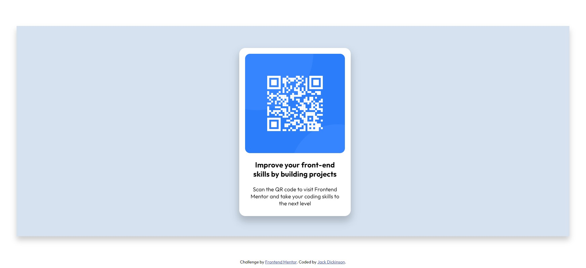

# Frontend Mentor - QR code component solution

This is a solution to the [QR code component challenge on Frontend Mentor](https://www.frontendmentor.io/challenges/qr-code-component-iux_sIO_H). Frontend Mentor challenges help you improve your coding skills by building realistic projects. 

## Table of contents

- [Overview](#overview)
  - [Screenshot](#screenshot)
  - [Links](#links)
- [My process](#my-process)
  - [Built with](#built-with)
  - [What I learned](#what-i-learned)
  - [Continued development](#continued-development)
- [Author](#author)

## Overview

### Screenshot

### Links

- Live Site URL: (https://jack99-dev.github.io/QR-Code-Component/)

## My process

### Built with

- HTML5
- CSS custom properties

### What I learned

This project was a good reminder on the basics of HTML/CSS, such as aligning elements and applying some basic styles.

### Continued development

Aligning and positioning elements is still sometimes a challenge for me, this is something I need to practice and refine.

## Author

- Website - (https://jackcdickinson.co.uk/)
- Frontend Mentor - (https://www.frontendmentor.io/profile/Jack99-DEV)

